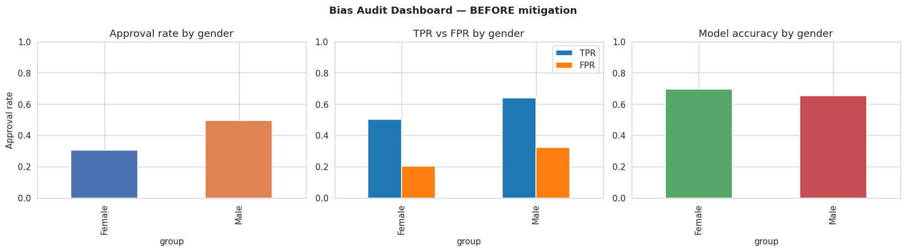
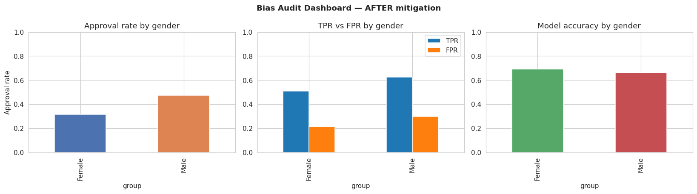
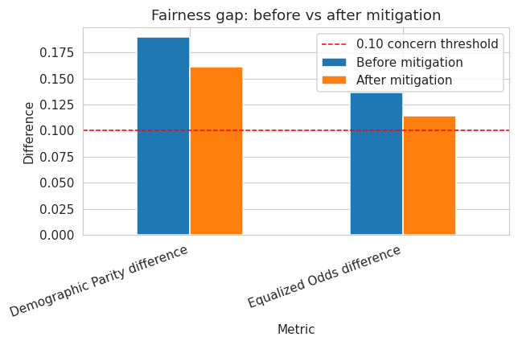

# AI Bias Audit & Fairness Report

Minor Project 14 — Artificial Intelligence

## Overview

This project audits a binary classification model (loan approval prediction) for bias against a protected attribute — gender. It uses demographic fairness metrics to measure the bias, visualizes the disparities across groups, applies a bias mitigation strategy, and compares fairness metrics before and after mitigation.

## Tasks

- Select a biased dataset
- Train a classification model
- Measure demographic parity
- Measure equalized odds
- Visualize bias across groups
- Apply a mitigation strategy
- Compare metrics before vs after mitigation
- Write ethical recommendations

## Dataset & Model

A synthetic loan-approval dataset (6,000 records) was used, built to reproduce the same failure pattern found in well-known biased public datasets (UCI Adult Income, COMPAS, German Credit):

- **Proxy-feature bias** — income and credit_score are, on average, historically lower for Female applicants, independent of actual merit.
- **Label bias** — historical approval decisions additionally penalized Female applicants beyond what their qualifications warranted.
- `gender` itself was never used as a model input feature — only age, income, credit_score, years_employed, and debt_ratio were used.

A Logistic Regression classifier was trained on a 75/25 train-test split to predict loan approval.

## Fairness Metrics

- **Demographic Parity difference** — the gap in approval rate between groups, regardless of actual qualification.
- **Equalized Odds difference** — the largest gap between groups in True Positive Rate or False Positive Rate, conditional on the true label.

A difference greater than 0.10 on either metric is treated as a meaningful fairness concern.

## Results

| Metric | Before mitigation | After mitigation | Change |
|---|---|---|---|
| Overall accuracy | 0.673 | 0.675 | +0.001 |
| Demographic Parity difference | 0.189 | 0.161 | -0.028 |
| Equalized Odds difference | 0.137 | 0.115 | -0.022 |
| Approval rate - Male | 0.495 | 0.476 | -0.019 |
| Approval rate - Female | 0.306 | 0.315 | +0.009 |

The baseline model reproduced the bias present in the training data even though gender was not a model feature — the bias entered through correlated features (income, credit_score) and through historically biased labels. This demonstrates that "fairness through unawareness" is not sufficient.

### Bias Visualization Dashboard — Before Mitigation



## Mitigation Strategy

Reweighing (Kamiran & Calders, 2012) was applied as a pre-processing mitigation technique. Each training example is re-weighted so that every (group, label) combination is represented as if group and label were statistically independent — down-weighting over-represented combinations and up-weighting under-represented ones, without altering or removing any data and without adding gender as a feature.

### Bias Visualization Dashboard — After Mitigation



### Fairness Gap Comparison



Reweighing reduced both fairness gaps at essentially no accuracy cost. The residual gap is expected: reweighing corrects for label-distribution bias, but cannot fully undo bias already encoded into correlated input features.

## Ethical Recommendations

1. Do not rely on "fairness through unawareness." Removing the protected attribute from the feature set is not sufficient — bias can still enter through correlated features and biased historical labels.
2. Audit regularly with group-wise metrics, not just overall accuracy.
3. Apply mitigation at the appropriate stage (pre-processing, in-processing, or post-processing) and document which was used and why.
4. Report the fairness-accuracy trade-off explicitly to stakeholders.
5. Monitor in production, since data drift can reintroduce disparities.
6. Keep a human in the loop for high-stakes decisions, with a clear appeals/override mechanism.

## Deliverables

- `AI_Bias_Audit_Fairness_Report.ipynb` — Fairness Audit Notebook
- `dashboard/` — Bias Visualization Dashboard (charts)
- `Responsible_AI_Report.docx` — Responsible AI Report

## How to Run

Requirements: `pandas`, `numpy`, `matplotlib`, `seaborn`, `scikit-learn`, `jupyter`

```bash
pip install pandas numpy matplotlib seaborn scikit-learn jupyter
jupyter notebook AI_Bias_Audit_Fairness_Report.ipynb
```

Then run all cells to reproduce the dataset, model, metrics, and visualizations.
